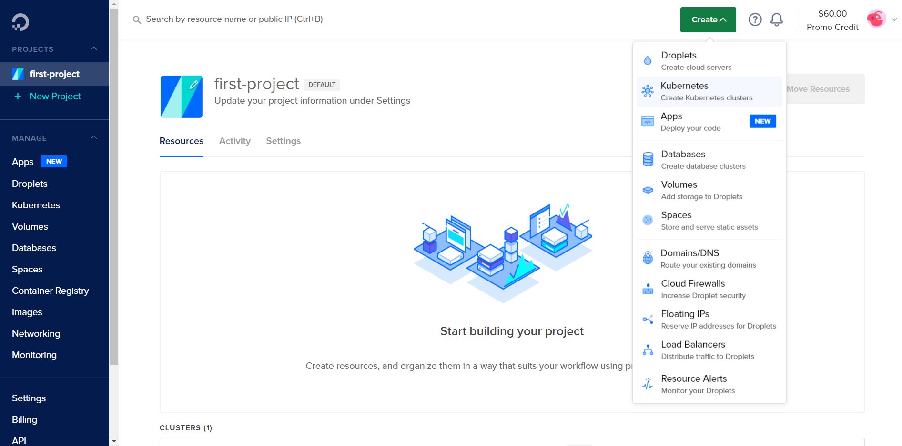
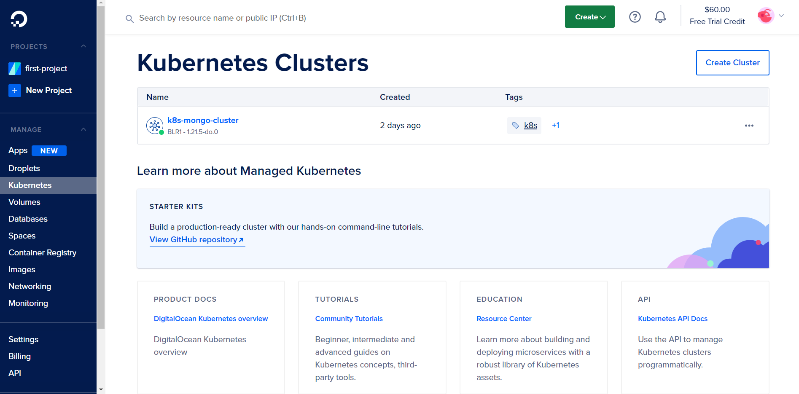
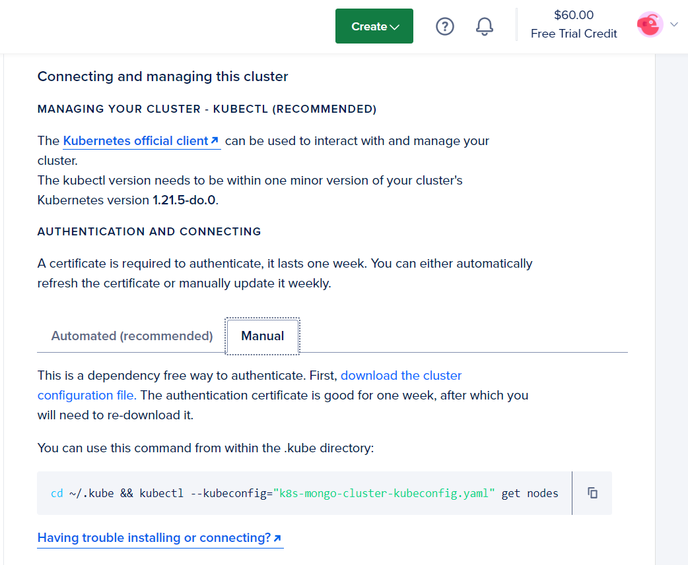
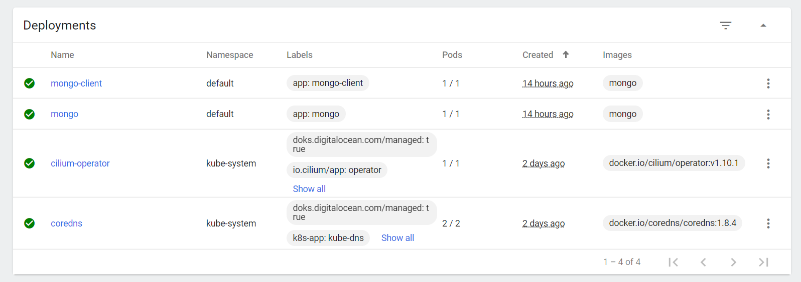
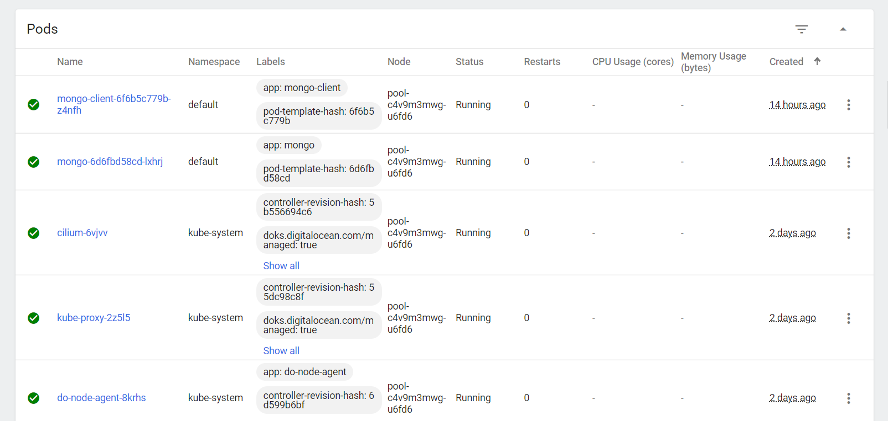
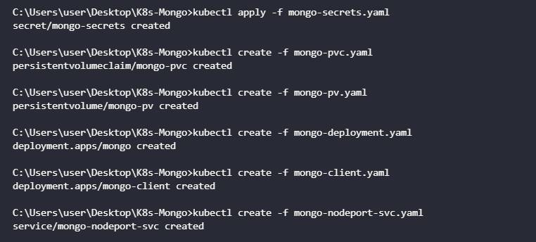
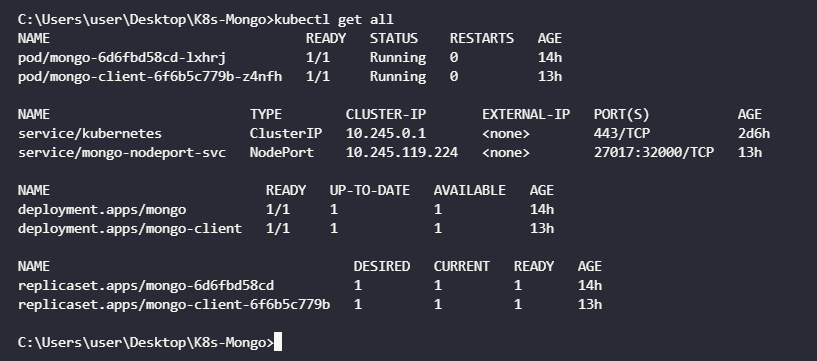
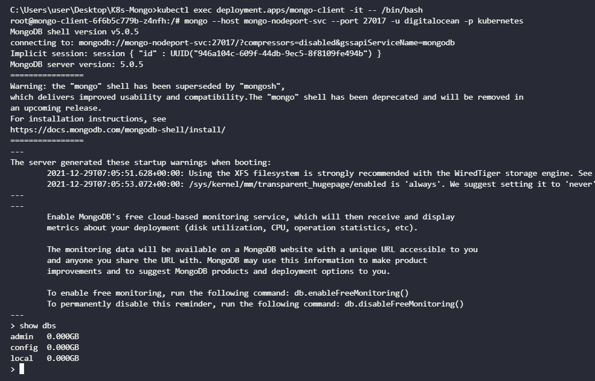

# DigitalOcean Kubernetes Challenge - Deploying a scalable NoSQL (MongoDB) database cluster
## Introduction
Kubernetes is an open source container orchestration platform that automates many of the manual processes involved in deploying, managing, and scaling containerized applications.

DigitalOcean Kubernetes is a managed Kubernetes service lets users deploy scalable and secure Kubernetes clusters without the complexities of administrating the control plane. In this challenge, we would be deploying a scalable NoSQL (MongoDB) cluster on Kubernetes.

## Prerequisites
- [DigitalOcean account](https://cloud.digitalocean.com/)
- [Kubernetes CLI - kubectl](https://kubernetes.io/docs/tasks/tools/#kubectl)

## Creating a K8s cluster
After the verification of the DigitalOcean account, K8s cluster can be created from the dashboard.



- Choose the nearest datacenter region.
- Give a name for the cluster (ie, k8s-mongo-cluster)
- Leave other metrics to their default values.
- Click Create Cluster.



## Connecting to the cluster
It takes around 5 minutes for the cluster to set up. In the meantime, the cluster config file can be downloaded using,
```
cd ~/.kube && kubectl --kubeconfig="k8s-mongo-cluster-kubeconfig.yaml" get nodes
```



## Creating MongoDB secrets
Secrets in Kubernetes are the objects used for supplying sensitive information to containers. For the security of our MongoDB instance, it is wise to restrict access to the database with a password. We will use secrets to mount our desired passwords to the containers. The secrets are encoded in base64 version in the `mongo-secrets.yaml` file.
```
apiVersion: v1
data:
  password: a3ViZXJuZXRlcw== # kubernetes
  username: ZGlnaXRhbG9jZWFu # digitalocean
kind: Secret
metadata:
  creationTimestamp: null
  name: mongo-secrets
```

To apply the changes to our K8s cluster,
```
kubectl apply -f mongo-secrets.yaml
```

## Creating MongoDB Persistent Volume
We require volumes to store the persistent data. In this way, even if the pods go down, the cluster data is not lost. There are 2 objects for creating volumes in Kubernetes.
1. Persistent Volume Claims (PVC)
2. Persistent Volumes (PV)

Create a PVC `mongo-pvc.yaml` file,
```
apiVersion: v1
kind: PersistentVolumeClaim
metadata:
  name: mongo-pvc
spec:
  accessModes:
    - ReadWriteOnce 
  resources:
    requests:
      storage: 1Gi
```

Create the PVC using the command,
```
kubectl create -f mongo-pvc.yaml
```

Now, we bind the PVC with a PV specified in `mongo-pv.yaml` file,
```
apiVersion: v1
kind: PersistentVolume
metadata:
  name: mongo-pv
spec:
  accessModes:
    - ReadWriteOnce
  capacity:
    storage: 1Gi
  hostPath:
    path: /data/mongo
```

Create the PV using the command,
```
kubectl create -f mongo-pv.yaml
```

## Deploying the MongoDB deployment
Using the official mongo image from docker hub, we create a `mongo-deployment.yaml` file to deploy the MongoDB cluster on Kubernetes.
```
apiVersion: apps/v1
kind: Deployment
metadata:
  labels:
    app: mongo
  name: mongo
spec:
  replicas: 1
  selector:
    matchLabels:
      app: mongo
  strategy: {}
  template:
    metadata:
      labels:
        app: mongo
    spec:
      containers:
      - image: mongo
        name: mongo
        args: ["--dbpath","/data/db"]
        livenessProbe:
          exec:
            command:
              - mongo
              - --disableImplicitSessions
              - --eval
              - "db.adminCommand('ping')"
          initialDelaySeconds: 30
          periodSeconds: 10
          timeoutSeconds: 5
          successThreshold: 1
          failureThreshold: 6
        readinessProbe:
          exec:
            command:
              - mongo
              - --disableImplicitSessions
              - --eval
              - "db.adminCommand('ping')"
          initialDelaySeconds: 30
          periodSeconds: 10
          timeoutSeconds: 5
          successThreshold: 1
          failureThreshold: 6
        env:
        - name: MONGO_INITDB_ROOT_USERNAME
          valueFrom:
            secretKeyRef:
              name: mongo-secrets
              key: username
        - name: MONGO_INITDB_ROOT_PASSWORD
          valueFrom:
            secretKeyRef:
              name: mongo-secrets
              key: password
        volumeMounts:
        - name: "mongo-pvc-dir"
          mountPath: "/data/db"
      volumes:
      - name: "mongo-pvc-dir"
        persistentVolumeClaim:
          claimName: "mongo-pvc"
```

Create the mongo deployment using the command,
```
kubectl create -f mongo-deployment.yaml
```

The deployment is now visible in the Kubernetes dashboard along with the pods and replica sets.





## Exploring the MongoDB deployment
To access the MongoDB database, a dedicated MongoDB client is created in a `mongo-client.yaml` file.

```
apiVersion: apps/v1
kind: Deployment
metadata:
  creationTimestamp: null
  labels:
    app: mongo-client
  name: mongo-client
spec:
  replicas: 1
  selector:
    matchLabels:
      app: mongo-client
  strategy: {}
  template:
    metadata:
      creationTimestamp: null
      labels:
        app: mongo-client
    spec:
      containers:
      - image: mongo
        name: mongo-client
        env:
        - name: mongo-client_INITDB_ROOT_USERNAME
          value: 'dummy'
        - name: mongo-client_INITDB_ROOT_PASSWORD
          value: 'dummy'
```

Deploy the client using,
```
kubectl create -f mongo-client.yaml
```

To connect to the database from outside the Kubernetes cluster, a Nodeport type service is created in the `mongo-nodeport-svc` file.
```
apiVersion: v1
kind: Service
metadata:
  labels:
    app: mongo
  name: mongo-nodeport-svc
spec:
  ports:
  - port: 27017
    protocol: TCP
    targetPort: 27017
    nodePort: 32000
  selector:
    app: mongo
  type: NodePort
```

Create the SVC using,
```
kubectl create -f mongo-nodeport-svc.yaml
```

In short, the commands used are,

  

The deployment and pods can also be viewed from the terminal.



Now, to access the database, we ssh into client.
```
kubectl exec deployment.apps/mongo-client -it -- /bin/bash
```

Inside the ssh, we can enter into the MongoDB instance using the username and password from the `mongo-secrets` file.
```
mongo --host mongo-nodeport-svc --port 27017 -u digitalocean -p kubernetes
```

To verify if the deployment is successful, we use the `show dbs` command to display the available databases. If the response is affirmative, then the MongoDB cluster has been successfully deployed. We can then perform various operations on the deployed instance.



## Conclusion
We have successfully deployed a MongoDB instance on a K8s cluster using DigitalOcean Kubernetes and then connected a client to the deployed instance to perform various database operations.